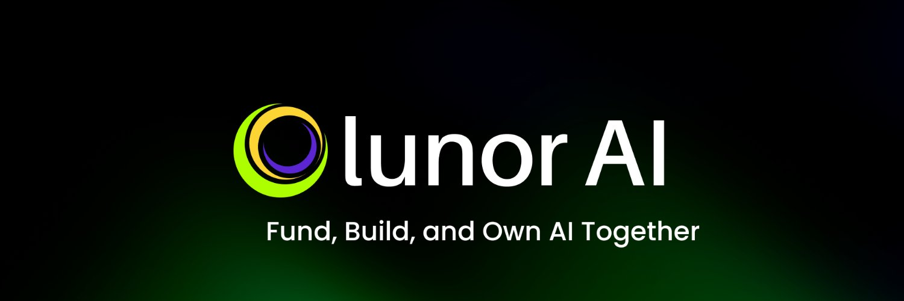

<!--suppress HtmlDeprecatedAttribute -->

# Hey there! 👋 Welcome to Lunor AI  

#### At **Lunor**, we're building the foundation for **crowdsourced, co-created, and co-owned Intelligence Systems**.  
#### With the power of Web3, we’re making it possible for anyone—from solo builders to global organizations—to contribute to AI innovation in a trustless and fair environment.

---

### 🌕 What is Lunor?

Lunor is a decentralized ecosystem designed to reshape how AI systems are built, funded, and owned.

- 🚀 **Lunor.Fund** – Crowdfund powerful Intelligence ideas and earn co-ownership in the systems you believe in.  
- 🧠 **Lunor.Quest** – Participate in open Intelligence Quests to build models, gather data, or improve agents.  
- 💎 **Lunor.Market** – Monetize and subscribe to Collective Intelligence developed by the Lunor community.

---

### 💡 Why Join Us?

- Build AI systems with global contributors  
- Fund and own the next breakthrough models  
- Get rewarded for your ideas, skills, and data  
- Be part of the future of **decentralized AI**

---

### 🌍 Join the Movement

We’re on a mission to unlock AI for everyone. If you believe in a future where **AI is open, collaborative, and fair**—we’d love to have you onboard.

---

### 🔗 Join our Community

 

 

  

